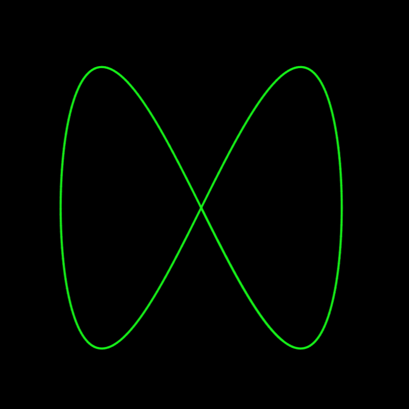
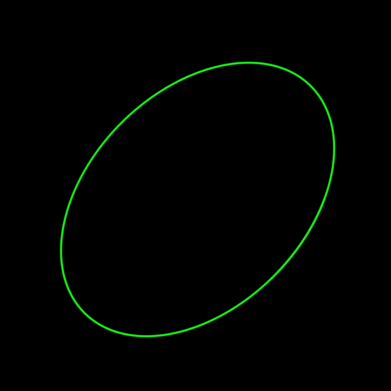
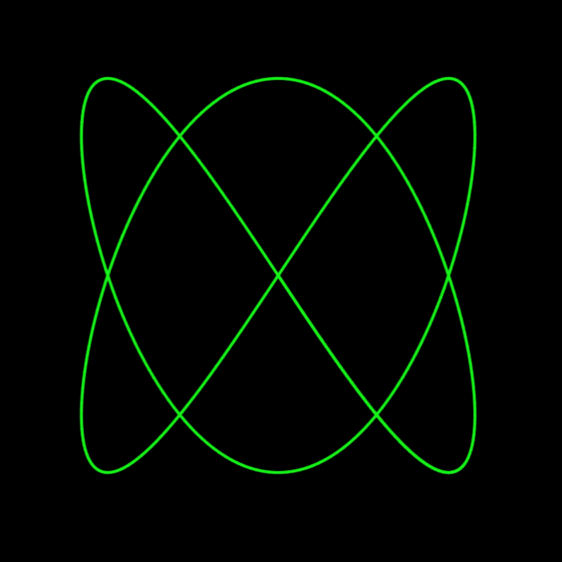

# Lissajous Curve Visualizer

This project is a simple web-based application that visualizes **Lissajous curves**. Lissajous curves are parametric equations that describe complex harmonic motion, often used in physics and mathematics to study waveforms and oscillations. Learn more about Lissajous curves on [Wikipedia](https://en.wikipedia.org/wiki/Lissajous_curve).

## Features

- **Interactive Controls**: Adjust parameters such as:
  - `ωx` (frequency along the x-axis)
  - `ωy` (frequency along the y-axis)
  - `θ` (phase shift)

## How It Works

The Lissajous curve is defined by the following parametric equations:

- `x = a * sin(ωx * t + θ)`
- `y = b * sin(ωy * t)`

Where:
- `a` and `b` are the amplitudes.
- `ωx` and `ωy` are the angular frequencies.
- `θ` is the phase difference.

The application uses the HTML5 `<canvas>` element to draw the curve and JavaScript to handle the animations and user interactions.

## How to Use

1. Open the `index.html` file in any modern web browser.
2. Use the sliders on the right side of the screen to adjust the parameters:
   - `ωx`: Frequency along the x-axis.
   - `ωy`: Frequency along the y-axis.
   - `θ`: Phase shift.
3. Watch the Lissajous curve update dynamically on the canvas as you adjust the sliders.

## Screenshots

<figure>
  
  <figcaption>Lissajous curve with ωₓ = 1, ωᵧ = 2, and phase shift θ = 0.</figcaption>
</figure>
 
<figure>
  
  <figcaption>Lissajous curve with ωₓ = 1, ωᵧ = 1, and phase shift θ = 120.</figcaption>
</figure>
 
<figure>
  
  <figcaption>Lissajous curve with ωₓ = 2, ωᵧ = 3, and phase shift θ = 0.</figcaption>
</figure>
 

## Acknowledgments

This project is inspired by the mathematical beauty of Lissajous figures and their applications in physics and engineering.
